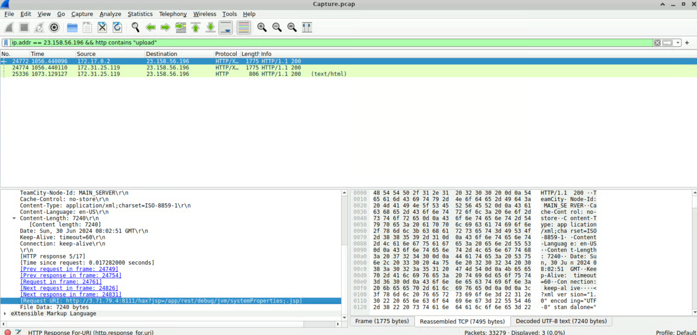

# JetBrains Lab

### Scenario

During a recent security incident, an attacker successfully exploited a vulnerability in our web server, allowing them to upload webshells and gain full control over the system. The attacker utilized the compromised web server as a launch point for further malicious activities, including data manipulation.&#x20;

As part of the investigation, You are provided with a packet capture (PCAP) of the network traffic during the attack to piece together the attack timeline and identify the methods used by the attacker. The goal is to determine the initial entry point, the attacker's tools and techniques, and the compromise's extent.


### Lab Info

* **Lab Title**: JetBrains Lab
* **Course**: [Network Forensics](https://cyberdefenders.org/blueteam-ctf-challenges/?categories=network-forensics)
* **Writeup-By**: Kartik Sharma

### Investigation

#### Q1. Identifying the attacker's IP address helps trace the source and stop further attacks. What is the attacker's IP address?

We only want to check which IP address is most active with our IP, i.e., the one with the most connections. In most cases, this is the attacker's IP address.\
We can sort IP's using Wireshark filter `ip.addr == <IP ADDRESS>`  and try to go through the IP Address conversation, you will find that a specific Address is trying to exploit the vulnerability and upload a file, which further helps him create a new user.

<figure><figcaption></figcaption></figure>

Follow the HTTP stream to see more details,

<figure><figcaption></figcaption></figure>

#### Q2. To identify potential vulnerability exploitation, what version of our web server service is running?

To identify the version of our web server service that is running, we can filter out the "`server version`" keyword on Wireshark in the HTTP stream.

<figure><figcaption></figcaption></figure>

#### Q3. After identifying the version of our web server service, what CVE number corresponds to the vulnerability the attacker exploited?

To get the CVE number, Google search `JetBrains (2023.11.3 (Build 147512) CVE` . We see that most of the sites like Splunk, Rapid7 show two [CVE-2024-27198](https://nvd.nist.gov/vuln/detail/CVE-2024-27198) and [CVE-2024-27199](https://nvd.nist.gov/vuln/detail/CVE-2024-27199)

When analysed deeply, and matching our adversary activity, we got the CVE number: CVE-2024-27198

<figure><figcaption></figcaption></figure>

#### **Q4. The attacker exploited the vulnerability to create a user account. What credentials did he set up?**

Search for `username or password`, You will easily find the credentials on the HTTP stream.

<figure><figcaption></figcaption></figure>

#### **Q5. The attacker uploaded a webshell to ensure his access to the system. What is the name of the file that the attacker uploaded?**

By analyzing the HTTP traffic and filtering for parameters like `filename or fileToUpload`, I identified a ZIP archive upload. Further investigation revealed that the attacker deployed a malicious TeamCity plugin following the exploitation of an authentication bypass vulnerability and the creation of an unauthorized administrative account. The uploaded ZIP package contained a JSP web shell embedded within the plugin structure. Upon the server's deployment of this plugin, the JSP file became accessible, enabling the attacker to execute arbitrary operating system commands via a cmd parameter. Subsequent HTTP requests confirmed remote code execution (RCE) and the establishment of persistent access. Consequently, the ZIP file containing the malicious plugin served as the primary artifact for the attacker's post-exploitation command execution.

<figure><figcaption></figcaption></figure>

#### **Q6. When did the attacker execute their first command via the web shell?**

Scrolling further down the Stream, we see:


```
cmd=ls
```


This is the first Command that the attacker executed. We can see the date on the HTTP Banner.

<figure><figcaption></figcaption></figure>

#### Q7. The attacker tampered with a text file that contained the credentials of the admin user of the web server. What new username and password did the attacker write in the file?

Now, when we search for more usernames and passwords, we couldn't find them in this file, which implies that we have to track another stream where the attacker uploaded a text file and executed commands

So in Wireshark filter, we search for an HTTP stream that contains "cmd"&#x20;


```
http contains "cmd="
```


<figure><figcaption></figcaption></figure>

Here, we found another stream(548) that is executing commands, Now follow that stream and search for `username or password` :

<figure><figcaption></figcaption></figure>

#### Q8. What is the MITRE Technique ID for the attacker's action in the previous question (Q7) when tampering with the text file?

The credential tampering activity maps to the following MITRE ATT\&CK technique:

```
T1565.001
```

Technique Description: MITRE ATT\&CK classifies this as:

```
Stored Data Manipulation
```

#### **Q9. The attacker tried to escape from the container, but he didn’t succeed. What is the command that he used for that?**

Before we start finding, we should know why it is unable to escape.The container lacked access to the host Docker daemon (`/var/run/docker.sock`). Without the Docker socket, the attacker could not create a new container with the host filesystem mounted, preventing a successful container breakout.To find out the commands, simply search for Docker and you will get the command​

<figure><figcaption></figcaption></figure>

<figure><figcaption></figcaption></figure>

Plain text the cmd and get the answer.

### &#x20;Investigation Summary <a href="#c773" id="c773"></a>

| Category                     | Details                              |
| ---------------------------- | ------------------------------------ |
| Vulnerability                | CVE-2024-27198                       |
| Target                       | TeamCity 2023.11.3                   |
| Attacker IP                  | 23.158.56.196                        |
| Initial Access               | Authentication Bypass                |
| Persistence                  | API Token + JSP Web Shell            |
| Execution                    | Arbitrary Command Execution          |
| Severity                     | Medium                               |
| MITRE ATT\&CK Technique      | T1565.001 – Stored Data Manipulation |
| Tools Used for Investigation | WireShark, Rapid7, Splunk            |
| Final Verdict                | Confirmed Compromise with RCE        |
